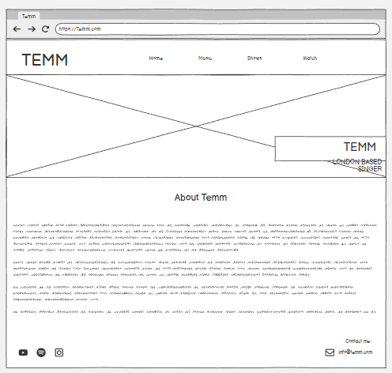
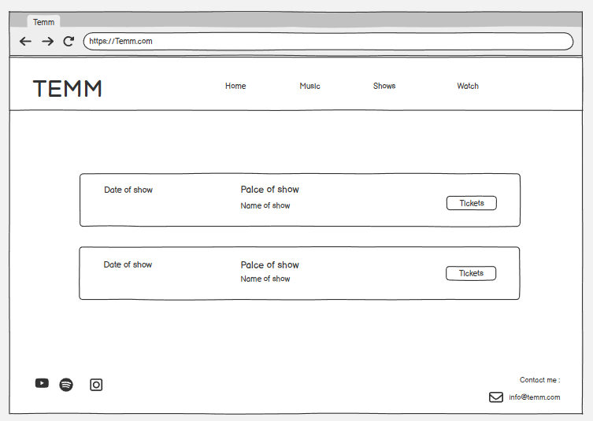
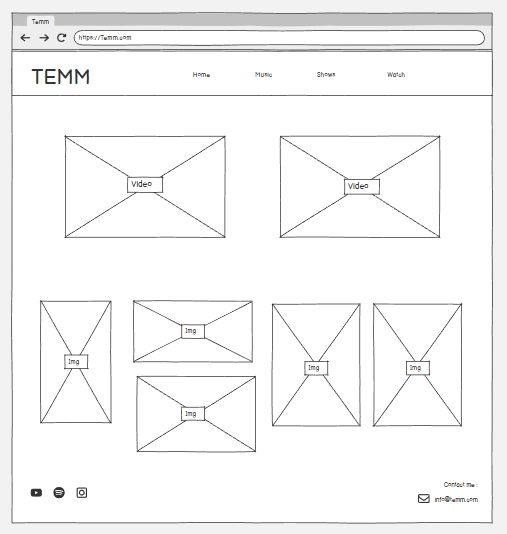
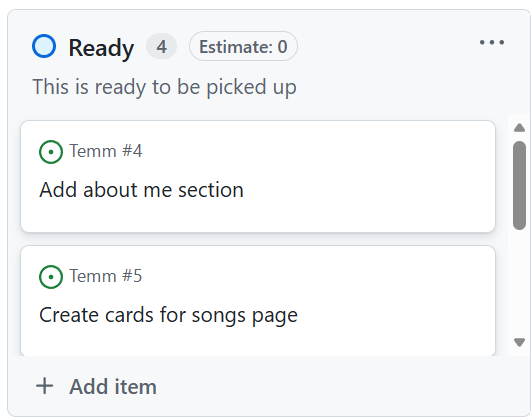
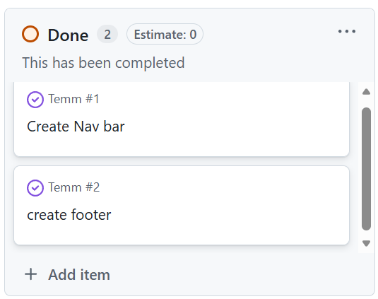

<!-- python -m http.server 8000 -->
<!-- 
git add .
git commit -m " Add message "
git push 
-->

#Temm

##Introduction

Temm is a singer based in London and I am (or maybe have by the time anyone sees this) creating a website for her fans or anyone interested in getting to know her art a little bit more. The users will be able to learn a bit about Rotem herself, listen to her music, purchase tickets to her shows (through links to her ticket suppliers), and see images and videos of Temm's previous performances. This project will use the following languages and frameworks: HTML and CSS <!--and JavaScript -->.

<!-- ADD IN I AM RESPONSIVE IMG -->
Am I responsive: http://ami.responsivedesign.is/
<!--  -->

[Click here to go to the live website!]( ) <!-- ADD LINK TO WEBSITE IN THESE () -->

## Table of contents

1. [Wireframes](#wireframes)
2. [User Stories](#user-stories)
3. [Objectives](#objectives)
4. [Features](#features)
    - [Navigation Bar](#navigation-bar)
    - [Footer](#footer)
    - [Music links](#music-links)
    - [Shows links](#shows-links)
    - [Videos](#videos)
5. [SEO](#seo)
6. [Testing](#testing)
    - [HTML](#html)
    - [CSS](#css)
    - [Manual Testing](#manual-testing)
7. [Bugs](#bugs)
8. [Deployment](#deployment)
9. [Credits](#credits)

## Wireframes

### Home 

[Table of contents](#table-of-contents)

### Music 

[Table of contents](#table-of-contents)

### Shows 

[Table of contents](#table-of-contents)

### Watch 

[Table of contents](#table-of-contents)

## User stories

I used the GitHub projects board to log my user stories to help me manage my project. This helped me break the project down into smaller tasks that would be more manageable by moving them into the in-progress section whilst I focused on them. once a task was complete, I could move it into the done section to help me see my progress.

<!-- ADD USERSTORIES IMAGES -->

[Table of contents](#table-of-contents)

## Objectives

- I want the user to see an image of Temm just under a navigation bar and I would like it to look static as the home page moves above it.

    - Was this achieved?
        - Yes

    - How was this achieved?
        - This effect was achieved using the fixed keyword. In style.css under #main-img you'll see "background: url('../images/Rotem-2.png') center center / cover no-repeat fixed;" at the end there we have the word 2fixed".  This pins the background image to the viewpoint instead of the element itself; Because of this the image doesnt scroll with the rest of the page and all the pther page elements scroll over it.
        The #main-img-outer container uses overflow: hidden and position: relative to contain the image and ensure it doesn't overflow, while the inner #main-img div applies the background image with the fixed attachment.

- I want the user to be able to find Temms social media platforms easily.

    - Was this achieved?
        - Yes 

    - How was this achieved?
        - In the wireframes we had the social icons only in the footer on each page. I decided to also place them in the nav bar this makes sure that our users see the icons even if they never reach the bottom of a page.

- I want the user to be able to find Temms music on all of the platforms that she streams her music from.

    - Was this achieved?
        - <!-- WAS IT ACHIEVED -->

    - How was this achieved?
        - <!-- HOW -->

- I want the user to be able to follow a link to a ticket selling site at the click of a button.

    - Was this achieved?
        - <!-- WAS IT ACHIEVED -->

    - How was this achieved?
        - <!-- HOW -->

- I want the user to be able to see videos and images from Temms previous shows.

    - Was this achieved?
        - <!-- WAS IT ACHIEVED -->

    - How was this achieved?
        - <!-- HOW -->

[Table of contents](#table-of-contents)

## Features

### Navigation Bar

- The navigation bar contains the links needed to use the website easily. This changes how it looks depending on the size of the screen it is being viewed on. 
    - <!-- On both the mobile and larger screen versions Temms name is a link back to the home page. -->
    - <!-- We have a neat list of the sites pages for easy navigation -->
    - <!-- The social media icons are links for users to access temms social media pages easily. -->

<!-- ADD NAV BAR IMAGES -->

[Table of contents](#table-of-contents)

### Footer

- The footer shows at the bottom of every page.
    - It includes social media links in the form of icons.
    - The footer also has a section for users to contact Temm via email.

<!-- ADD FOOTER IMAGE -->

[Table of contents](#table-of-contents)

### Music links

- We have a page for Temms songs where users can find links to each song on every platform Temm streams it from.

<!-- ADD SONGS FUNCTION IMAGES -->

[Table of contents](#table-of-contents)

### Shows links

- There is a page for Temms up and comming shows where users can find links to buy tickets.

<!-- ADD SONGS FUNCTION IMAGES -->

[Table of contents](#table-of-contents)

### Videos

- On the watch page you can find embedded vidios from Temms previous shows.

<!-- ADD SONGS FUNCTION IMAGES -->

[Table of contents](#table-of-contents)

## SEO

To improve the search engine optimisation of the site I have added some keywords in a meta tag to my base.html. I used WordTracker to research these short-tail and long-tail keywords to find out which words had the least competition.

This is a list of all the keywords I came up with <!-- ADD LIST --> .

<!-- ADD SEO IMAGES -->

I ended up using these:

- <!-- ADD USED WORDS -->
- <!-- ADD USED WORDS -->
- <!-- ADD USED WORDS -->
- <!-- ADD USED WORDS -->
- <!-- ADD USED WORDS -->

<!-- ADD IMAGES OF IMPLIMENTED SEO -->

[Table of contents](#table-of-contents)

## Testing

## HTML

HTML was tested using the official [W3C validator](https://validator.w3.org/nu/) 
<!-- MAKE SURE TO TEST -->

### Home

The following errors/warnings were found:

<!-- ADD TESTING HTML IMG -->

1.<!-- ADD ERROR -->
    - To fix this I <!-- ADD HOW IT WAS FIXED-->

Retested: Error cleared

### Music

No errors were found.

<!-- ADD MUSIC ERROR IMG -->

### Shows

No errors were found.

<!-- ADD MUSIC ERROR IMG -->

### Watch

No errors were found.

<!-- ADD WATCH ERROR IMG -->

[Table of contents](#table-of-contents)

## CSS
 
CSS was tested using the official [(Jigsaw) validator](https://jigsaw.w3.org/css-validator/)
<!-- MAKE SURE TO TEST CSS -->

No errors were found: <!-- HOPEFULLY -->

[Table of contents](#table-of-contents)

### style.css

<!-- ADD CSS TESTING IMG -->

## Manual Testing 

Component | Function | Does it work? | Fixed? 
--------- | --------- | ----------------- | ------ |
Navbar: Logo | Takes user to home page | <!-- does it work? --> | N/A
Navbar: home button | Takes user to home page | <!-- does it work? --> | N/A
Navbar: Music button | Takes user to music page | <!-- does it work? --> | N/A
Navbar: Shows button | Takes user to shows page | <!-- does it work? --> | N/A
Navbar: Watch button | Takes user to watch page | <!-- does it work? --> | N/A
Navbar: Spotify icon | Takes user to Temms spotify | <!-- does it work? --> | N/A
Navbar: Instagram icon | Takes user to Temms instagram | <!-- does it work? --> | N/A
Navbar: Youtube icon | Takes user to Temms Youtube | <!-- does it work? --> | N/A
Music: song 1 card spotify link | links to this song on spotify | <!-- does it work? --> | N/A
Music: song 1 card youtube link | links to this song on youtube | <!-- does it work? --> | N/A
Music: song 2 card spotify link | links to this song on spotify | <!-- does it work? --> | N/A
Music: song 2 card youtube link | links to this song on youtube | <!-- does it work? --> | N/A
Music: song 3 card spotify link | links to this song on spotify | <!-- does it work? --> | N/A
Music: song 3 card youtube link | links to this song on youtube | <!-- does it work? --> | N/A
Music: song 4 card spotify link | links to this song on spotify | <!-- does it work? --> | N/A
Music: song 4 card youtube link | links to this song on youtube | <!-- does it work? --> | N/A
Music: song 1 card spotify link | links to this song on spotify | <!-- does it work? --> | N/A
Shows: show 1 card link | links to this shows ticket sale point | <!-- does it work? --> | N/A
Shows: show 2 card link | links to this shows ticket sale point | <!-- does it work? --> | N/A
Watch: Video 1 | Plays 1st video | <!-- does it work? --> | N/A
Watch: Video 2 | Plays 2nd video | <!-- does it work? --> | N/A
Footer: Spotify icon | Takes user to Temms spotify | <!-- does it work? --> | N/A
Footer: Instagram icon | Takes user to Temms instagram | <!-- does it work? --> | N/A
Footer: Youtube icon | Takes user to Temms Youtube | <!-- does it work? --> | N/A

[Table of contents](#table-of-contents)

## Bugs

<!-- ADD BUGS -->

I was having problems figuring out ......

I realised that I hadn't ....

To fix this I ....

[Table of contents](#table-of-contents)

## Deployment

<!--
<- Create a new app on heroku 
- In resources add heroku postgres
- In settings review config vars, copy the DATABASE_URL
- In gitpod make a file called env.py, use this to store our environment variables.
- make sure env.py is in gitignore file
- Add your secret key environment variable to both the env.py file and heroku config vars
- Reference the env file in the settings.py file.
- Add the secret key environment variable to settings.py.
- Highlight database section and comment it out, 
replace with the following:
DATABASES = {
   'default': dj_database_url.parse(os.environ.get("DATABASE_URL"))
}
- run migrations
-->

[Table of contents](#table-of-contents)

## Credits

Thankyou to Rotem for helping me bring her vision to life.

images from: 

Am I responsive: http://ami.responsivedesign.is/

To help with the SEO I used word tracker - https://www.wordtracker.com/?fpr=refer&fp_sid=bingof

To test the html is used <!-- ADD WEBSITE USED -->

To test the css is used <!-- ADD WEBSITE USED -->

[Table of contents](#table-of-contents)